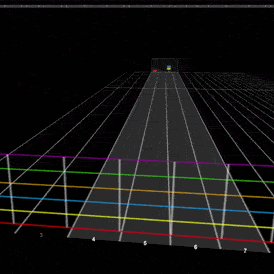
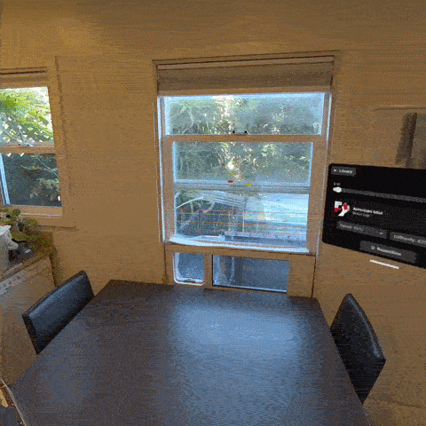
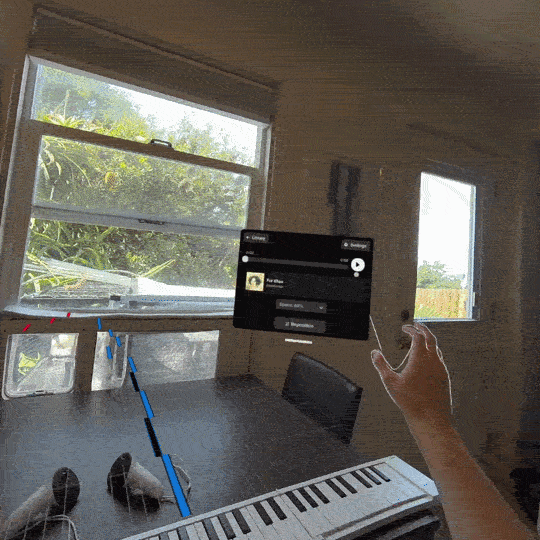

  

  
  
  
  

# RockyRoad

- A web browser note-highway music app for guitar and piano with full support for WebXR-capable headsets
- Note-highway logic and visuals distilled from [ChartPlayer](https://github.com/mikeoliphant/ChartPlayer) into Typescript and ThreeJS
- Intended for you to self-host and runs entirely on your machine — your song library never leaves your computer or local network

**[Try GitHub Pages demo](https://weblings.github.io/RockyRoad/)** — no install needed.

## Quick Start
1. **Install [Node.js](https://nodejs.org/)** (version 20 or newer). This gives you the `node` and `npm` commands used below.
   - **Windows:** `winget install OpenJS.NodeJS.LTS` (winget ships with Windows 10/11 already)
   - **macOS:** `brew install node` (needs [Homebrew](https://brew.sh))
   - **Linux (Debian/Ubuntu):** `sudo apt install nodejs npm`
2. **Get the code.** Either `git clone https://github.com/weblings/RockyRoad.git`, or on the
   [GitHub repo page](https://github.com/weblings/RockyRoad), click the green **Code**
   button → **Download ZIP**, then unzip it — no git required.
3. **Open a terminal in this project's `v2` folder.**
4. **Run `npm install`.** This downloads the project's dependencies into a `node_modules` folder —
   one-time setup, takes a minute or two. You'll see a wall of text; that's normal.
5. **Run `npm run dev`.** This starts the app's local server. When it's ready, it prints a URL that
   looks like `https://localhost:8081/`.
6. **Open that URL in your browser.** You should now be able to access RockyRoad! See [Troubleshooting](#troubleshooting) and [FAQ](#faq) for more info.

## Play your own songs

1. **Convert your library.** RockyRoad reads a chart format called OpenSongChart. Use
   [RockyRoadImport](https://github.com/weblings/RockyRoadImport) to convert your songs to it.
   - **Using the demo:** use the "Load local songs" button in the top-right corner. 
      - **Note:** this only works if your charts are stored on same the machine with the demo open. To load charts from a device on your local network (advised path for XR devices), you should self-host.
   - **Self-hosting:** continue to steps 2-3 below.
2. **Point RockyRoad at your converted songs** (self-hosting only). In the `v2` folder, make a copy
   of `song-server.config.example.json` and rename the copy to `song-server.config.json`, then edit
   its `songsDir` field to a path pointing to the folder containing your converted songs.
3. **Restart `npm run dev`** (self-hosting only). Your songs will now always automatically show up
   in the library alongside the demo songs.

## Troubleshooting
**Not seeing RockyRoad on another device**
- Confirm your device and the computer are on the **same Wi-Fi network**
- Confirm `npm run dev` is still running in its terminal — closing that window stops the server.
- Some networks/routers block devices from seeing each other by default ("client isolation" or
  "AP isolation") — check your router's settings if the above doesn't resolve it.
- A firewall on the computer running the server may need to allow the port shown in the
  `npm run dev` output (`8081` by default). 
- Confirm the address you entered ends with a colon and the port `:8081`.
- Check if the address you entered is using `https`, `http` likely won't work.
- If your browser warns you the connection isn't "secure" - Click through the warning ("Advanced" → "Proceed") to continue.

**My own songs don't show up:**
- If you're running the GitHub pages demo, refer to [Play your own songs](#play-your-own-songs). This section is for self-hosted.
- Double-check `song-server.config.json`'s `songsDir` path — a typo means it finds nothing.
- Confirm that folder actually contains converted song folders (each with a `song.json` inside),
  not the original, unconverted files.
- Restart `npm run dev` after any change to `song-server.config.json` — it's only read at startup.

**How do I enter the XR Immersive App?**
- Your headset's browser needs to support WebXR (Quest / Horizon OS, Android XR, and Vision OS all should)
- When you visit the xr.html page, a button in your browser's UI should appear saying something like "Enter VR". Click that button to launch the immersive app
- The "Enter VR" button visible in RockyRoad's UI in desktop.html will not launch an Immersive app on your headset. That is a shortcut to get to xr.html.

## FAQ

**Can I play my own songs?**
Yes — convert them first with [RockyRoadImport](https://github.com/weblings/RockyRoadImport), then
follow ["Play your own songs"](#play-your-own-songs) above. On [the GH Pages demo](https://weblings.github.io/RockyRoad/),
its upload button lets you try converted songs directly instead — no self-hosting needed.

**What's OpenSongChart / ChartPlayer / ChartConverter?**

Repos by [Mike Oliphant](https://github.com/mikeoliphant). Without this amazing tech foundation, I would not have even attempted this project!
- [OpenSongChart](https://github.com/mikeoliphant/OpenSongChart) is an open format for song charts
- [ChartPlayer](https://github.com/mikeoliphant/ChartPlayer) is a cross-platform application for playing along to OpenSongChart charts
- [ChartConverter](https://github.com/mikeoliphant/ChartConverter) is an app for converting other chart formats to OpenSongChart

**Do I need to know npm or web development to use this?**
No — Quick Start above is copy-paste, with each step explained.

**Do I need a VR/XR headset?**
No, desktop is the default experience.

**Why do I need to run a local server when self-hosting?**
Two separate technical reasons, not just one: WebXR requires a secure context (HTTPS or
`localhost`), which a plain downloaded folder doesn't have on its own; and separately, the app's
code is loaded as browser "ES modules," which browsers refuse to load directly from a local file
for security reasons, regardless of WebXR. Both mean a real local server — `npm run dev` — is
needed either way, so there's no simpler prebuilt alternative today.

**Why don't you support ChartPlayer's Drums scene**
No technical blocker. I don't play drums or have access to a drumset currently.

## For developers

For the tech stack, architecture, and directory layout, see [`v2/ARCHITECTURE.md`](v2/ARCHITECTURE.md).

For gotchas hit while building this project, see
[`Analysis/lessons/README.md`](Analysis/lessons/README.md) — written primarily for AI coding
agents working in this repo, but worth a skim if you're a human developer onboarding too.

## License

RockyRoad is licensed under the [GNU General Public License v3.0 or later](LICENSE). Its
note-highway logic and visuals are distilled from [ChartPlayer](https://github.com/mikeoliphant/ChartPlayer)
(also GPL-3.0), so this project carries the same license forward.

## Intent and AI Disclaimer

- This repo is vibecoded. Some project goals were to experiment with working in a fully vibecoded repo and using AI to translate my past decade of Unity and XR coding knowledge to WebXR, ThreeJS, and IWSDK.
- During covid quarantine, one of my hobbies was using note-highway softwares to play guitar (on desktop) and piano (in XR).
- When I came across the repos around ChartPlayer, I realized they could work as a basis for a unified open-source app that could support both use-cases from the ground up.
